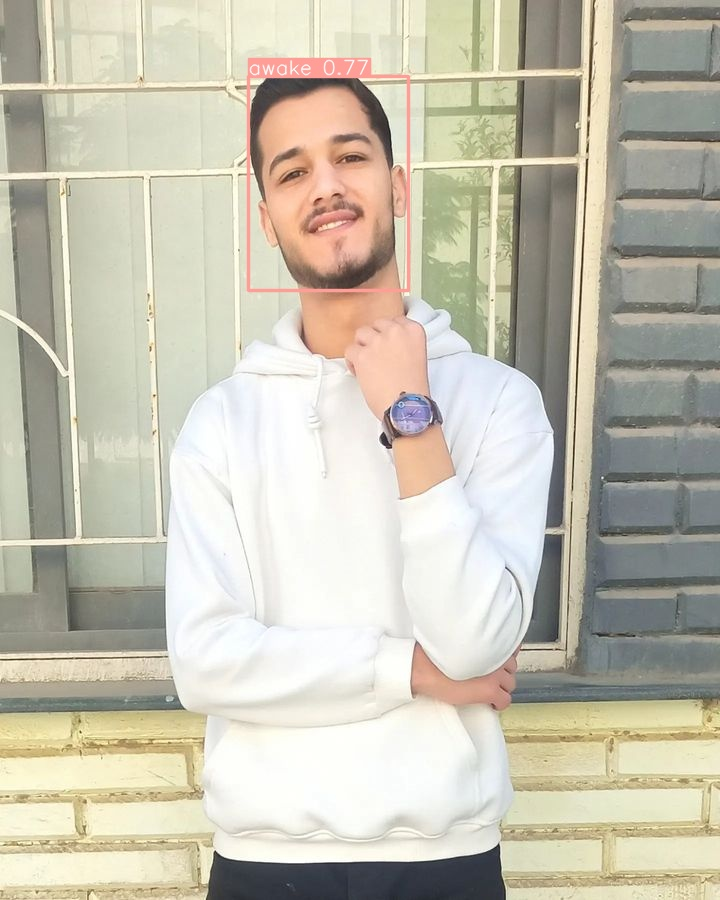

# Drowsiness-Detection-yolov10 

This repository contains code for training a YOLOv10 model for detecting drowsiness in images. The model is trained using the COCO dataset with custom annotations for drowsiness, awake, and yawn classes.

# Project Structure
### /data.yaml: Configuration file specifying paths to training, validation, and test datasets along with class names and number of classes.
### /weights/: Directory to store pretrained and trained model weights.
### /train.py: Script for training the YOLOv10 model.
### /predict.py: Script for making predictions using the trained model.
### /evaluate.py: Script for evaluating model performance on test data.
### /utils/: Directory containing utility functions for data processing and evaluation.

# [here on kaggle all the output.](https://www.kaggle.com/code/abdoghazala/drowsiness-detection-yolov10/output)

